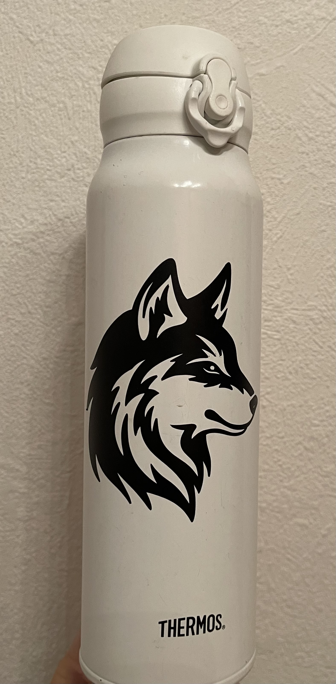

Seit Jahren bin ich ein Fan von [Maker Spaces](https://www.bildung.digital/artikel/einfach-machen-maker-spaces-der-schule) und wünsche mir ein ähnliches Angebot an meiner Schule.
Unsere Werkstatt ist noch ziemlich klassisch eingerichtet und verfügt über keine Werkzeuge, die digitale Modellierung voraussetzen.
Leider habe ich den Umgang mit solchen Geräten wie 3D-Druckern, Plottern oder Lasercuttern nie gelernt, da sie kein Teil meines Studiums waren.
Auch unter meinen Kolleg:innen gibt es niemanden, der mir die Verwendung erklären könnte.

Nächstes Schuljahr unterrichte ich weniger und hab den Kopf frei für ein neues Projekt 😊
Als ersten Schritt habe ich einen kleinen Plotter angeschafft und angefangen, erste Projekte damit umzusetzen!

# Cricut Joy
Nach ein wenig Recherche habe ich mich für das [kleinste Modell von Cricut](https://cricut.com/de-de/schneidemaschinen/cricut-joy/cricut-joy/cricut-joy/2007992.html) entschieden und ich bin erstaunlich zufrieden damit.

Es ist ein sehr kompaktes Gerät, das sich gut verstauen und wieder herausholen lässt.
Die Einrichtung war leicht: Beim Einrichten der Software wurde ein Beispielprojekt vorgeschlagen, das ich mit einer mitgelieferten Folie umsetzen konnte.
Dadurch wurde mir sinnvoll erklärt, wie ich ein Motiv aus einer Folie schneide.

Mit den ersten Projekte wurden dann Türen, Trinkflaschen und anderes beklebt.
Sehr gut ließen sich auch die Grußkarten umsetzen, die bei den Beschenkten sehr gut ankamen.

{:style="display:block; margin-left:auto; margin-right:auto" width="200" loading="lazy"}

Im ersten Versuch ein Treffer: Ein Vinyl-Wolf auf meiner Flasche
{:.figcaption}

# Proprietärer Anteil
Auch hier habe ich wieder das Problem, dass das Gerät selbst günstig ist, aber die Materialien nur vom Hersteller kommen können.
Das trifft nur auf einen Teil des Materials zu ("Smart Material"), während ich auch mit normalem Papier, normaler Pappe, 3rd Party Folien etc. viele Projekte umsetzen kann.
Da Cricut weit verbreitet ist, habe ich auch schon Matten und Werkzeug von anderen Herstellern kaufen können, die für den Cricut Joy geeignet sind.

Allerdings habe ich die Grußkarten-Vorlagen, Stifte und Messer bisher nur als Originalprodukte gefunden.

# Software und Abo
Für die Plotter von Cricut kann ausschließlich [Cricut Design Space](https://design.cricut.com) benutzt werden.
Diese Software ist grundsätzlich kostenlos nutzbar, so dass ich Texte und Basis-Formen gestalten und plotten kann.
Ich kann auch Bilder importieren und dann plotten, so dass ich viele Tutorials gefunden habe, die diese Software mit z.B. Inkscape kombinieren.

Es gibt mit *cricut access* eine Abo-Option für 10€/Monat, die Zugriff auf Bilder, Schriftarten, vollständige Projekte und erweiterte Bearbeitungsmöglichkeiten für importierte Bilder bietet.
Ich habe sie im Probemonat genutzt und war von der Einfachheit überrascht, mit der ich  Einstiegsprojekte umsetzen konnte.
Die Suchfunktionen in diesem Archiv könnten zwar besser sein, aber dieses Archiv bietet einen deutlichen Mehrwert, da ich Vorlagen gefunden habe, die ich sehr schnell selbst umsetzen konnte.

# Fazit
Den Umgang mit einem Plotter kann man sich selbst beibringen. 😎

Grüße an das #LebenslangeLernen, das funktioniert 2024 ganz gut mit der [offiziellen Anleitung](https://help.cricut.com/hc/de/articles/360015214914-Kurzanleitung),
[Büchern aus der Bibliothek](https://www.mitp.de/KREATIV/Plotten-Basteln/Plotten-mit-dem-Cricut-Joy-Cricut-Joy-Xtra.html), [Youtube](https://www.youtube.com/results?search_query=cricut+joy) und [zahlreichen Anleitungen im Netz](https://naehfrosch.de/plotter-cricut-joy-erste-schritte/).

Das kleine Gerät reicht völlig aus.
Es hat auch so schon einen breiten Funktionsumfang und die maximale Breite von 13 cm war für alle meine Projekte ausreichend.
Jetzt freue ich mich darauf, das Gerät im nächsten Schuljahr in die Hände meiner Schüler:innen zu geben 🙃
